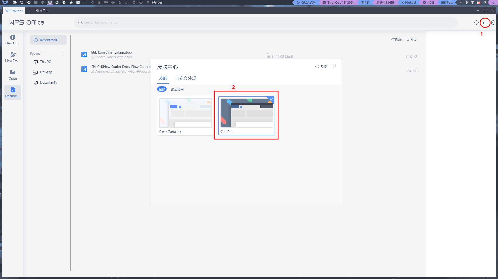
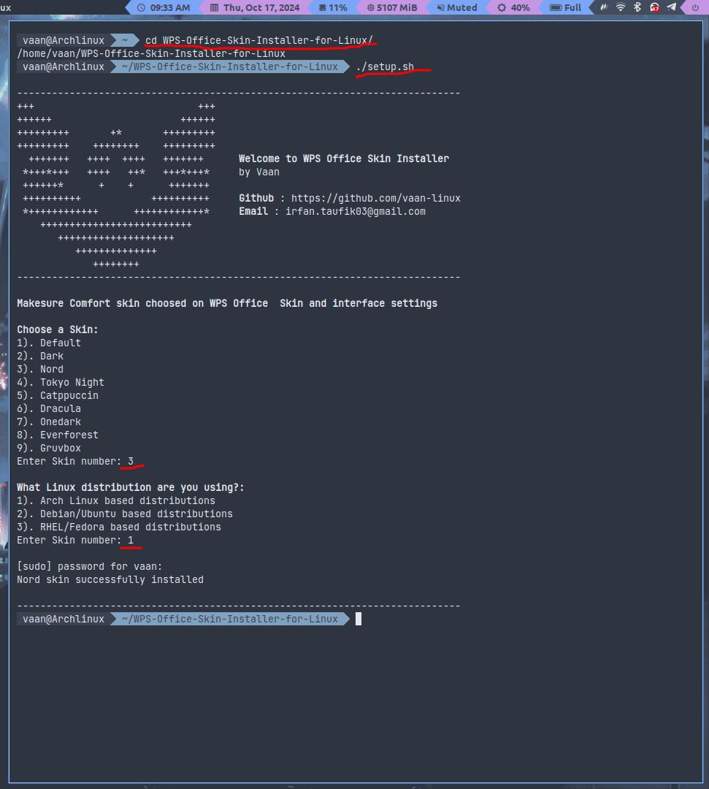
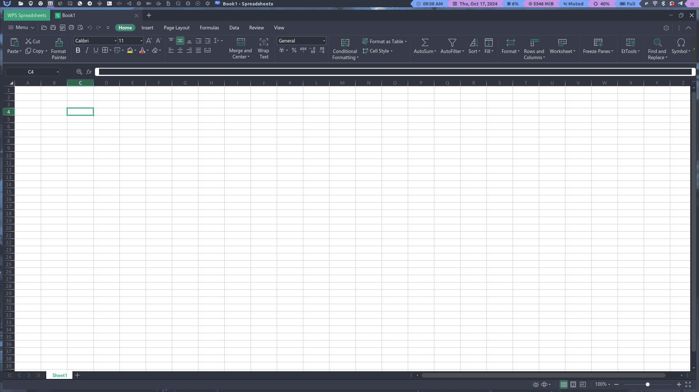
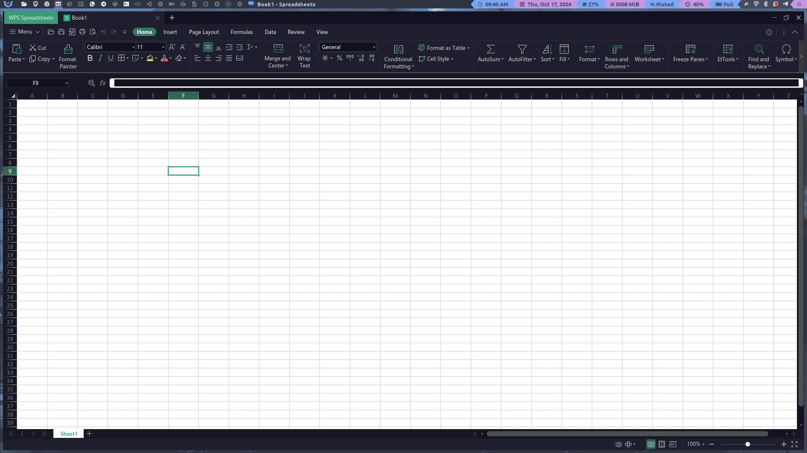
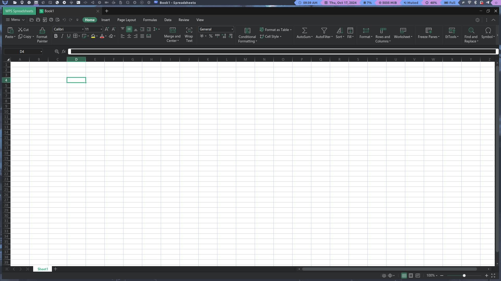
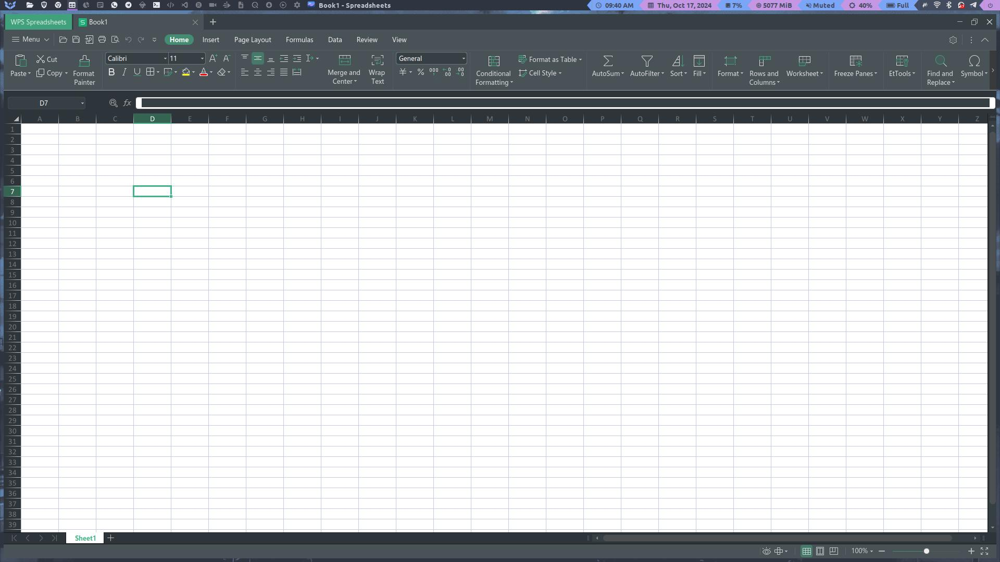
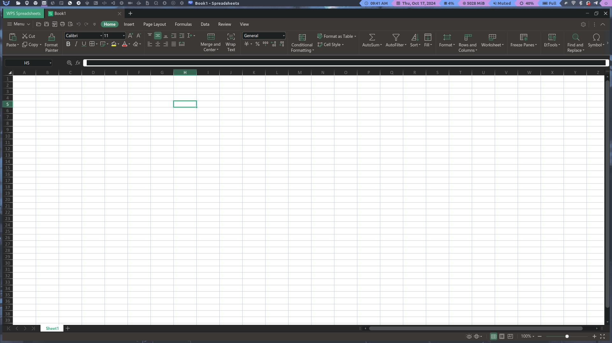

# WPS Office Skin Installer for Linux


This script allows you to install and switch WPS Office skins/themes to several variants. Currently, there are 9 skins/themes available:  
1) Default  
2) Dark  
3) Nord  
4) Tokyo Night  
5) Catppuccin  
6) Dracula  
7) Onedark  
8) Everforest  
9) Gruvbox  

Note: This script only works on the International version of WPS Office (v.11).

## Steps
### Make sure Git is installed on your system
If not, install it first:

**Arch Linux and its derivatives:**
```bash
sudo pacman -S git
```
**Debian/Ubuntu and its derivatives:**
```bash
sudo apt install git
```
RHEL/Fedora and its derivatives:
```bash
sudo dnf install git
```

### Clone the GitHub Repository
```bash
git clone https://github.com/vaan-linux/WPS-Office-Skin-Installer-for-Linux
```
```bash
cd WPS-Office-Skin-Installer-for-Linux
```
```bash
sudo chmod +x setup.sh
```
```bash
./setup.sh
```
### Make sure Comfort skin choosed on WPS Office Skin Center


### Setup
Select the desired skin and ensure the distribution matches

Then, restart or reopen your WPS Office

## Preview
**Nord**


**Catppuccin**


**Dark**


**Everforest**


**Gruvbox**


[GPL3](https://www.gnu.org/licenses/gpl-3.0-standalone.html)
